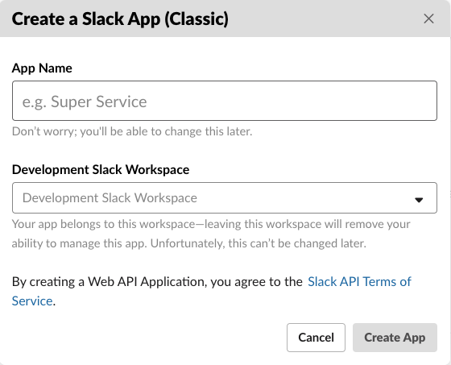
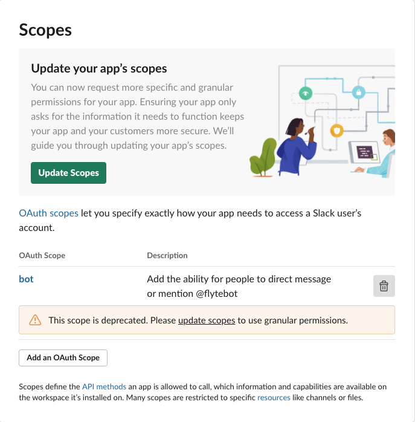

# Creating Classic Slack Apps

The flyte-slack pack currently makes use of Slack's [Real Time Messaging API](https://api.slack.com/rtm), which is not supported by default in newer applications. 
Because of this, we need to create a classic Slack app instead.

## Registering the application

- Navigate to [https://api.slack.com/apps?new_classic_app=1](https://api.slack.com/apps?new_classic_app=1) where you'll encounter the following pop-up.

- Assign a name and choose a workspace for the application.

## Assigning permissions for the bot

The application starts with minimal permissions for the bot user, thus we must add them ourselves. These depend on your specific use case,
but it's generally the same flow.

- While on the page of your Slack application's configuration page, navigate to the "OAuth & Permissions" tab and scroll down to the "Scopes" segment.

- Add the permissions required for your application scenario, i.e. chat:write:bot...

> _You can read more about app permissions [here](https://api.slack.com/scopes)._